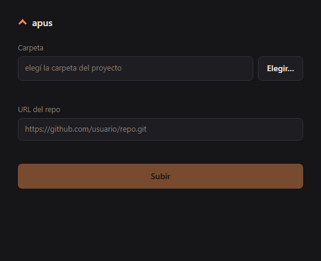

<p align="center">
  
</p>

<h1 align="center">apus</h1>

<p align="center">Elegís una carpeta, pegás la URL del repo, y se sube todo.</p>

---

*Apus* es el género del vencejo, el ave de vuelo nivelado más rápida que existe. La herramienta hace lo mismo con tus cambios: `git init` si hace falta, `add`, `commit` y `push`, en un paso, para volver a trabajar.

Corre en Windows, Linux y macOS. Es un solo binario, sin dependencias más allá de `git`.

## La ventana

<p align="center">
  
</p>

1. **Carpeta**: la escribís o tocás **Elegir…** para abrir el selector del sistema.
2. **URL del repo**: la pegás. Si la carpeta ya tenía remoto, aparece sola.
3. **Subir**.

Por detrás, apus inicializa el repo si la carpeta no lo era, pone esa URL como `origin`, hace `add -A`, un commit con mensaje automático y el push.

Tiene estos cuidados:

- Si la carpeta apuntaba a otro remoto y pegás una URL distinta, te avisa antes de subir.
- Si elegís una subcarpeta de otro repo, no sube el repo de afuera.
- Si el repo de GitHub ya tiene archivos (por ejemplo, lo creaste con README), explica por qué git rechaza el push.
- Recuerda la última carpeta.
- Se cierra sola cuando cerrás la ventana.

En Windows la ventana es `apusw.exe`, que no abre terminal: ni la suya ni la de cada `git`. Si algo falla antes de abrir, muestra el error en un cuadro de diálogo.

## La terminal

Dentro de un repo que ya tiene remoto:

```bash
apus                        # add + commit (mensaje automático) + push
apus "fix: arreglo bug X"   # con mensaje propio
apus -n                     # muestra lo que haría, sin hacerlo
apus status                 # estado de los repos de la carpeta actual
apus ui                     # abre la ventana
```

| Opción | Qué hace |
|---|---|
| `-m, --message <msg>` | Mensaje de commit (igual que el argumento posicional). |
| `-n, --dry-run` | Muestra los comandos sin ejecutar nada. |
| `-q, --quiet` | Silencia la salida. |
| `-h, --help` | Ayuda. |
| `-V, --version` | Versión. |

Si la carpeta no es un repo, ofrece iniciarla. Si la rama nunca se publicó, hace `git push -u`. Para la terminal, el remoto lo ponés vos una vez con `git remote add origin <url>`.

## Instalación

### Descargar

Cada versión trae los binarios listos en [Releases](https://github.com/miguelacaceresrios/Apus/releases/latest). No hace falta Go.

| Sistema | Terminal | Ventana |
|---|---|---|
| Windows x64 | [`apus.exe`](https://github.com/miguelacaceresrios/Apus/releases/latest/download/apus.exe) | [`apusw.exe`](https://github.com/miguelacaceresrios/Apus/releases/latest/download/apusw.exe) |
| Windows ARM | [`apus-windows-arm64.exe`](https://github.com/miguelacaceresrios/Apus/releases/latest/download/apus-windows-arm64.exe) | [`apusw-windows-arm64.exe`](https://github.com/miguelacaceresrios/Apus/releases/latest/download/apusw-windows-arm64.exe) |
| Linux x64 | [`apus-linux-amd64`](https://github.com/miguelacaceresrios/Apus/releases/latest/download/apus-linux-amd64) | la misma, con `apus ui` |
| Linux ARM | [`apus-linux-arm64`](https://github.com/miguelacaceresrios/Apus/releases/latest/download/apus-linux-arm64) | la misma, con `apus ui` |
| macOS Intel | [`apus-darwin-amd64`](https://github.com/miguelacaceresrios/Apus/releases/latest/download/apus-darwin-amd64) | la misma, con `apus ui` |
| macOS Apple Silicon | [`apus-darwin-arm64`](https://github.com/miguelacaceresrios/Apus/releases/latest/download/apus-darwin-arm64) | la misma, con `apus ui` |

- **Windows**: poné `apus.exe` en una carpeta del `PATH`. Los binarios no están firmados, así que la primera vez SmartScreen puede frenarlos: *Más información → Ejecutar de todos modos*.
- **Linux y macOS**:

  ```bash
  mkdir -p ~/.local/bin
  curl -Lo ~/.local/bin/apus https://github.com/miguelacaceresrios/Apus/releases/latest/download/apus-linux-amd64
  chmod +x ~/.local/bin/apus
  ```

  Cambiá `apus-linux-amd64` por el de tu sistema. En macOS, si Gatekeeper lo bloquea: `xattr -d com.apple.quarantine ~/.local/bin/apus`.
- **Verificar la descarga**: cada release trae `SHA256SUMS.txt`, con la huella de cada archivo. Comparala con la tuya: `Get-FileHash apus.exe` en Windows, `sha256sum ~/.local/bin/apus` en Linux y macOS.

### Compilar

Hace falta [Go 1.25](https://go.dev/dl/).

**Windows**

```powershell
git clone https://github.com/miguelacaceresrios/Apus apus
cd apus
.\scripts\build.ps1        # deja dist\apus.exe y dist\apusw.exe
.\scripts\atajo.ps1        # atajo en el escritorio
```

- `dist\apus.exe` es para la terminal: agregá `dist` al `PATH`.
- `dist\apusw.exe` es la ventana y es lo que abre el atajo.
- `atajo.ps1 -Repos "D:\proyectos"` hace que el selector arranque en esa carpeta.

**Linux y macOS**

```bash
git clone https://github.com/miguelacaceresrios/Apus apus && cd apus
make build                             # dist/apus
install -Dm755 dist/apus ~/.local/bin/apus
```

Para un acceso en el menú de Linux, creá `~/.local/share/applications/apus.desktop`:

```ini
[Desktop Entry]
Type=Application
Name=apus
Comment=Subir una carpeta a su repo
Exec=apus ui --quit-on-close --dir %h/proyectos
Icon=/ruta/a/apus/assets/apus.png
Terminal=false
Categories=Development;
```

El selector de carpetas usa `zenity` o `kdialog` en Linux, y el nativo en Windows y macOS.

**Solo la versión en Bash**

[`scripts/apus.sh`](scripts/apus.sh) es la versión original: la misma lógica de terminal en un solo archivo, sin ventana.

```bash
curl -o ~/.local/bin/apus https://raw.githubusercontent.com/miguelacaceresrios/Apus/master/scripts/apus.sh
chmod +x ~/.local/bin/apus
```

## Configuración

Variables de entorno, todas opcionales:

| Variable | Por defecto | Qué hace |
|---|---|---|
| `APUS_MESSAGE_TEMPLATE` | `chore: actualización {date}` | Plantilla del mensaje; `{date}` es la fecha y hora. |
| `APUS_DATE_FORMAT` | `%Y-%m-%d %H:%M` | Formato de la fecha, al estilo de `date`. |
| `APUS_DEFAULT_BRANCH` | `main` | Rama inicial cuando apus hace `git init`. |
| `APUS_REMOTE` | — | Remoto a usar si hay varios y ninguno se llama `origin`. |
| `APUS_REPOS_DIR` | carpeta actual | Dónde busca repos `apus status`, y dónde arranca el selector. |
| `NO_COLOR` | — | Salida sin colores. |

## Códigos de salida

| Código | Significado |
|---|---|
| `0` | Todo bien, incluido "no había nada que hacer". |
| `1` | Problema con el repo: sin remoto, HEAD desprendido, commit rechazado por un hook. |
| `2` | Uso incorrecto. |
| `3` | Falló el push. El commit ya quedó hecho: corregí y volvé a correr. |

`apus status --json` devuelve el formato de un módulo `custom` de Waybar.

## Seguridad

La ventana es una página servida por el mismo binario en `127.0.0.1`. Cada vez que arranca genera un token. Solo atiende pedidos que traigan ese token, una cabecera propia y el `Host` exacto. Así, ninguna otra página del navegador, ni un dominio que resuelva a `127.0.0.1`, puede subir nada.

## Desarrollo

```
apus/
├── *.go              núcleo, terminal y servidor de la ventana (package main)
├── ui/index.html     la ventana
├── assets/           íconos
├── docs/             imágenes del README
├── scripts/
│   ├── apus.sh       versión en Bash
│   ├── build.ps1     compilación en Windows
│   ├── atajo.ps1     atajo de escritorio
│   └── test.sh       pruebas de la terminal
├── tools/icongen/    genera los íconos
├── Makefile
└── CHANGELOG.md
```

**Pruebas**

```bash
make test                    # todo: vet, go test y las dos baterías de la terminal
```

En Windows, `.\scripts\build.ps1 -Test`.

- `go test` cubre la ventana: carpeta nueva, repo al día, cambio de URL, carpeta vacía, subcarpeta de otro repo, remoto con archivos, entradas inválidas y la detección del binario de ventana.
- `scripts/test.sh` son 31 casos de la terminal, que corren contra `apus.sh` y contra el binario (`APUS_IMPL=go`).

Todo corre en carpetas temporales, con un repo local haciendo de GitHub, y sin tocar tu configuración de git. CI corre lo mismo en Linux y Windows.

**Íconos**: `make icons` o `go run ./tools/icongen`. La figura está definida ahí y en el `<path>` de `ui/index.html`; si cambia una, cambiá la otra.

Los cambios de cada versión están en [CHANGELOG.md](CHANGELOG.md).

## Licencia

[MIT](LICENSE)
